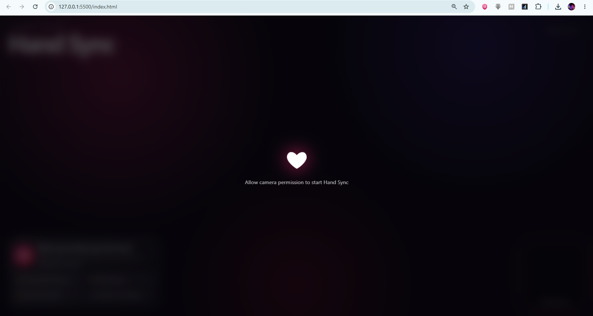
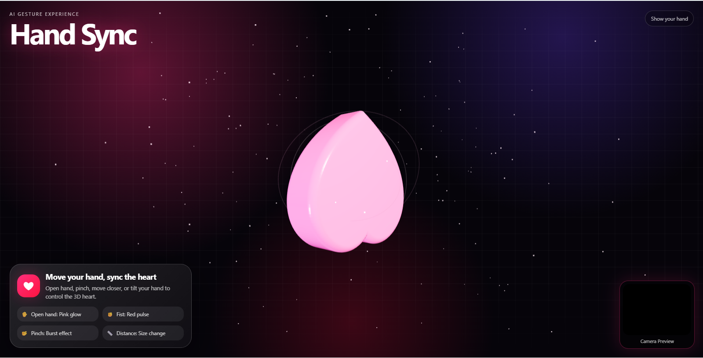
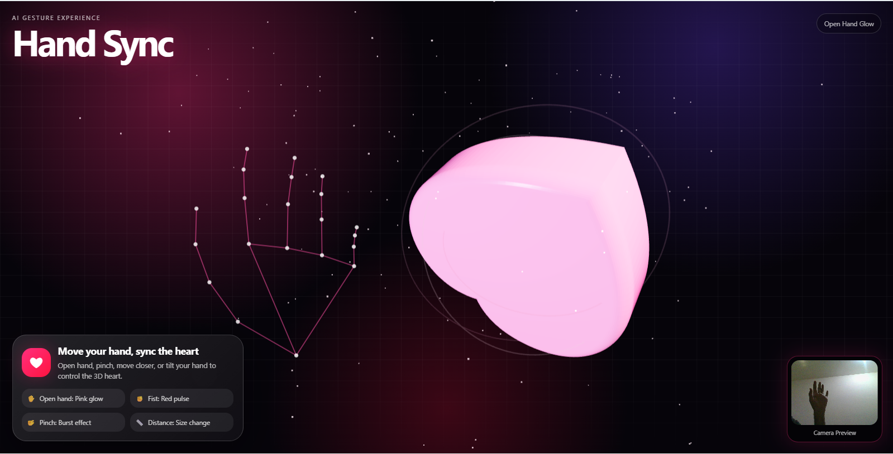

# Hand Sync ❤️

Hand Sync is a browser-based AI gesture experience where users control a glowing 3D heart with hand movement using their camera.

## ✨ Features

- Real-time hand tracking
- 3D heart animation
- Open hand, fist and pinch gesture detection
- Heart movement based on hand position
- Size changes based on hand distance
- Rotation based on hand tilt
- Professional glassmorphism UI
- Camera preview and gesture overlay

## 🛠 Tech Stack

- HTML
- CSS
- JavaScript
- Three.js
- MediaPipe Hands

## 🚀 How to Run

1. Download or clone this repository.
2. Open `index.html` in a browser.
3. Allow camera permission.
4. Move your hand in front of the camera to control the heart.

> Camera access works best on `localhost` or HTTPS.

## 📸 Screenshots

## 📸 Screenshots

## 📌 Project Purpose

This project was built as an interactive web experiment to explore AI-powered hand tracking, gesture-based UI control, and creative 3D browser experiences.

## 👨‍💻 Developer

**Shehryar Aslam**  
Android & Web Developer  
Founder @ SiteMaster ERP  

LinkedIn: https://www.linkedin.com/in/shehryar-muhammad-aslam-97572939b/  
Email: mrsherryusa@gmail.com

## 📄 License

This project is open source and available for learning and portfolio use.
